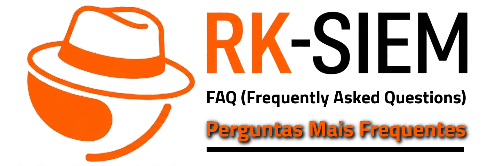

***
###### 1. O que é RK-SIEM? 

**RK-SIEM** é um acrônimo para RK (*Ricardo Kléber*, autor da ferramenta) e SIEM (*Security Information and Event Management*).

###### 2. O que é SIEM?

**SIEM** é a junção de dois sistemas de segurança em um: **SIM** (*Security Information Management*) e **SEM** (*Security Event Management*) resultando em uma solução de segurança da informação que centraliza, correlaciona e analisa registros (logs) de diversas fontes (servidores, hosts e ativos de rede) em tempo real e permite o acompanhamento em painéis (dashboards) personalizados, geração e envio de alertas.

###### 3. Como é/foi desenvolvido o RK-SIEM?

O **RK-SIEM** tem dois módulos principais:
- **RK-SIEM-CORE**: Núcleo do sistema baseado no [OpenSearch](https://opensearch.org/).
- **RK-SIEM-UI**: Interface Web do sistema baseado no [OpenSearch Dashboards](https://docs.opensearch.org/latest/dashboards/).

###### 4. O RK-SIEM é realmente gratuito?

**SIM!!!** Todos os componentes e ferramentas complementares utilizadas no **RK-SIEM** têm código-fonte aberto (Open Source) sem restrições de utilização.

###### 5. Há algum suporte disponível para dúvidas e personalizações?

**NÃO!!!** A solução foi criada e é mantida pelo professor **Ricardo Kléber** para utilização em ambiente acadêmico (embora possa ser utilizada em ambientes corporativos) e disponibilização para uso público sem garantias ou responsabilidades relacionadas a manuteção.

###### 6. Onde encontro mais informações sobre o RK-SIEM?

Os arquivos do projeto são mantidos no [GitHub](https://github.com/ricardokleber/rk-siem) e no [GitLab](https://gitlab.ifrncn.com.br/ricardokleber/rk-siem) do autor e vídeos com tutoriais e dicas no canal Youtube [@RKIFRNCN](https://www.youtube.com/@rkifrn).