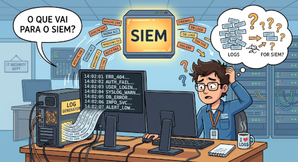
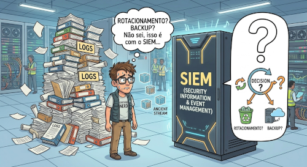
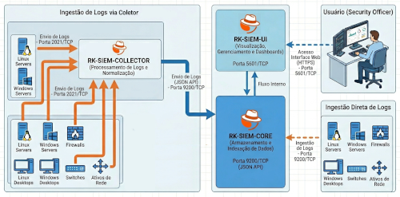
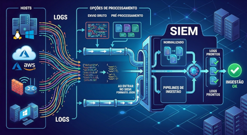

**1. Questões a Considerar: O que vai ser enviado?**

É importante fazer um planejamento sobre O QUE será enviado a partir dos hosts para ser processado e analisado no SIEM.

Em um primeiro momento talvez a intenção seja enviar TODOS os Logs de TODOS os hosts, mas, o volume de tráfego gerado e a demanda por armazenamento e indexação no SIEM devem ser considerados.

Na maioria dos casos, faz-se a opção por realizar "filtros" (seleção sobre o que será enviado de cada host) e o levantamento de serviços específicos em execução e então toma-se a decisão sobre o que vale a pena, de fato, enviar para ser processado pelo SIEM.

Além de Logs, tem sido cada vez mais comum o envio para geranciadores de Logs informações relacionadas a métricas e traces (comunicação entre microsserviços). O SIEM tem condições, também, de processar analisar e disponibilizar informações sintetizadas sobre esses dados.

***

**2. Questões a Considerar: Formato de Envio**

Os primeiros gerenciadores de Logs costumavam ser configurados para receber os logs dos hosts em formato "bruto" (sem qualquer filtragem) e então todo o processamento era feito pelo gerenciador (hoje o SIEM).

Mas, atualmente, muitos hosts (ou coletores instalados neles) têm a capacidade de fazer um pré-processamento (filtro/parser/pipeline) para que os logs sejam enviados já tratados e com isso diminuir o trabalho do SIEM.

Esses procedimentos recebem vários nomes, entre eles:
- Normalização de Logs
- Padronização de Logs
- Enriquecimento de Logs
- Anonimização de Logs
- Personalização de Logs

Uma decisão importante no planejamento é verificar SE os hosts têm essa capacidade de pré-processamento e, em caso positivo, se vale a pena utilizá-los, analisando o impacto desse pré-processamento comparado à possibilidade de processar essas filtragens no SIEM.

***

**3. Questões a Considerar: Quando enviar?**

Os SIEMs modernos (e o RK-SIEM naturalmente) têm a capacidade de processar dados praticamente em "tempo real", mas, isso é realmente necessário (e conveniente)?

É necessário considerar o número de hosts que enviam dados ao SIEM e o volume desses dados/logs enviados e decidir SE e QUAIS hosts/serviços terão seus logs analisados em tempo real pelo SIEM.

É possível configurar/personalizar o envio dos logs de acordo com a criticidade de sua análise e conveniência para serem enviados periodicamente em períodos como de 30 em 30 segundos, a cada minuto, a cada 5 minutos...

Dependendo do que se está monitorando pode ser conveniente programar o envio de logs para ser feito somente quando eventos específicos acontecerem ou quando deverminados serviços se encontrarem em situações específicas.

***

**4. Questões a Considerar: E depois de enviar?**

Os Logs depois de serem enviados pelos hosts ao SIEM ainda precisam existir?

Vários serviços de geração de logs nos próprios hosts já dispõem de configurações que fazem um rotacionamento de logs diariamente e/ou semanalmente ou em um período determinado. Isso é realmente necessário?

Se o volume de logs gerado é muito grande e o rotacionamento é implementado é necessário/possível armazenar logs mais antigos em algum sistema de backup?

Se sim, é importante definir a periodicidade (e se possível a automação do processo) dos backups e o tempo de armazenamento. Essa decisão pode ser em função de questões legais (LGPD, GDPR, ...) ou a partir de políticas institucionais.

Uma outra decisão pode ser a de descartar os logs gerados/armazenados nos hosts uma vez enviados ao SIEM. Nesses casos, o planejamento de arnazenamento e backup passa a ser exclusivo sobre os registros indexados e armazenados no próprio SIEM.

***

**5. Cenários de Ingestão de Logs no RK-SIEM:**

***

**6. Lista (não exaustiva) de possibilidade de Ingestão de Logs**

<ul>
    <li>Logs no formato JSON (uso de Templates)</li>
    <ul>
        <li>Linux (RSyslog / Syslog-NG)</li>
        <li><del>Windows (Windows Event Forwarding - WEF -> Binários ou XML)</del></li>
     </ul>
    <li>Uso de Logs Shippers (Data Forwarders) nos Hosts</li>
    <ul>
        <li>FluentBit</li>
        <li>Beats (Filebeat, Metricbeat, Packetbeat, Heartbeat, Winlogbeat, Auditbeat)</li>
     </ul>
    <li>Agentes: OpenTelemetry (OTel Agent)</li>
    <li>RK-SIEM-COLLECTOR / Data Prepper / FluentBit (como coletor)</li> 
    <li>Outros coletores (Logstash | Open Telemetry Collector)</li> 
</ul>

***

**7. Ingestão de Logs: Visão Geral**

***

**Assista à Videoaula explicativa sobre o assunto clicando na imagem abaixo:**

