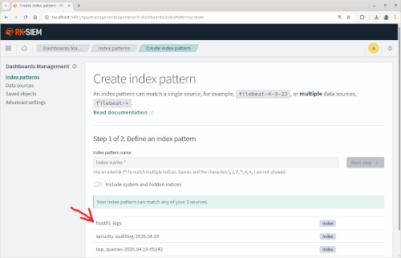
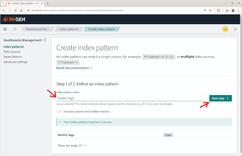

Neste primeiro laboratório o objetivo é enviar Logs de um host com Linux (Debian) diretamente a partir do RSyslog para o RK-SIEM.

Para isso utilizaremos um Docker com o Debian Linux "enxuto" (slim) adicionado dos seguintes pacotes:

<ul>
<li>RSyslog (Gerenciador de Logs do Linux)</li>
<li>RSyslog-Elasticsearch (Pacote para envio dos Logs para o RK-SIEM/OpenSearch)</li>
<li>OpenSSH -Servidor SSH para gerar logs de acesso a serem enviados para o RK-SIEM</li>
</ul>

O módulo *rsyslog-mmjsonparse* (presente no pacote RSyslog) será ativado para envio de Logs no formato JSON.

o módulo *omelasticsearch* (presente no pacote RSyslog-ElasticSearch) será ativado para envio de logs em bloco (bulk) para o RK-SIEM/OpenSearch.

Conteúdo do docker-compose.yml referente ao Host 01:

```
services:
 rk-siem-host01:
	image: ricardokleber/rk-siem-host01:latest
	container_name: rk-siem-host01
	hostname: rk-siem-host01
	tty: true
	stdin_open: true
	restart: always
```

Conteúdo adicionado ao arquivo de configuração do RSyslog (*/etc/rsyslog.conf*) para formatar os logs em um Template JSON:

```
# Template para formatar o JSON
    template(name="json-template" type="list") {
        constant(value="{")
        constant(value="\"@timestamp\":\"") property(name="timereported" dateFormat="rfc3339")
        constant(value="\",\"host\":\"") property(name="hostname")
        constant(value="\",\"severity\":\"") property(name="syslogseverity-text")
        constant(value="\",\"facility\":\"") property(name="syslogfacility-text")
        constant(value="\",\"message\":\"") property(name="msg" format="json")
        constant(value="\"}")
```

Conteúdo adicionado ao arquivo de configuração do RSyslog (*/etc/rsyslog.conf*) para conexão ao RK-SIEM e envio dos Logs autenticando-se com usuário admin/admin:

```
# Envio para o RK-SIEM-CORE

action(type="omelasticsearch"
	server="172.19.0.1"
	serverport="9200"
	template="json-template"
	searchIndex="host01-logs"
	bulkmode="on"
	errorfile="/var/log/rsyslog-erros.log")
```

***

**Roteiro Passo a Passo:**

**1. Baixe o Repositório GIT do projeto**

```
git clone https://gitlab.ifrncn.com.br/ricardokleber/rk-siem.git
```

**2. Entre no diretório/pasta do projeto referente ao LAB01**

(O docker-compose deste diretório já contém as configurações do HOST01)

```
cd rk-siem/roteiros/03-lab01
```

**3. Levante o RK-SIEM-CORE**

```
docker compose up -d rk-siem-core
```

**4. Levante o RK-SIEM-UI**

```
docker compose up -d rk-siem-ui
```

(Após alguns segundos você já poderá subir a interface Web RK-SIEM-UI acessando http://localhost:5061 em um navegador)


**5. Levante o RK-SIEM-HOST01**

```
docker compose up -d rk-siem-host01
```

**6. Entre no HOST01 e ative os serviços RSyslog e SSH**

```
docker exec -it rk-siem-host01 bash
```

```
rsyslogd
```

```
service ssh start
```

***

**7. Acesse o RK-SIEM com as credenciais padrão**

```
Username: admin | Password: admin
```

**8. No Menu do canto superior esquerdo, na sessão 'Management' selecione 'Dashboards Management'**


**9. Selecione a opção 'Index patterns' para configurar o seu primeiro índice no RK-SIEM (para receber os Logs do HOST01)'**


**10. Clique no botão 'Create index pattern' para Criar seu primeiro índice**


Observe que o Host 01 já enviou logs para o RK-SIEM (A indicação do índice 'host01-logs' já aparece como fonte disponível)



**11. Preencha o campo 'Index pattern name' indicando que o índice que será criado deverá receber todo o tráfego de índices começando com 'host01-logs'**

```
host01-logs*
```



***

**Assista à Videoaula explicativa sobre o assunto clicando na imagem abaixo:**

<a href="https://www.youtube.com/watch?v=DoedlfxmR6g" target="_blank"></a>