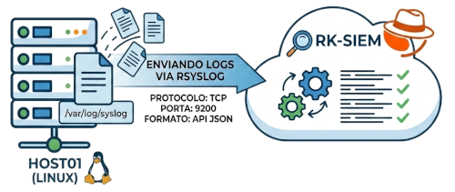

**Lab 01 :: Ingestão Direta de Logs (Linux + RSyslog)**



Neste primeiro laboratório o objetivo é enviar Logs de um host com Linux (Debian) diretamente a partir do RSyslog para o RK-SIEM.

Para isso utilizaremos um Docker com o Debian Linux "enxuto" (slim) adicionado dos seguintes pacotes:

<ul>
<li>RSyslog (Gerenciador de Logs do Linux)</li>
<li>RSyslog-Elasticsearch (Pacote para envio dos Logs para o RK-SIEM/OpenSearch)</li>
<li>OpenSSH -Servidor SSH para gerar logs de acesso a serem enviados para o RK-SIEM</li>
</ul>

O módulo *rsyslog-mmjsonparse* (presente no pacote RSyslog) será ativado para envio de Logs no formato JSON.

o módulo *omelasticsearch* (presente no pacote RSyslog-ElasticSearch) será ativado para envio de logs em bloco (bulk) para o RK-SIEM/OpenSearch.

Conteúdo do docker-compose.yml referente ao Host 01:

```
services:
 rk-siem-host01:
	image: ricardokleber/rk-siem-host01:latest
	container_name: rk-siem-host01
	hostname: rk-siem-host01
	tty: true
	stdin_open: true
	restart: always
```

Conteúdo adicionado ao arquivo de configuração do RSyslog (*/etc/rsyslog.conf*) para formatar os logs em um Template JSON:

```
# Template para formatar o JSON
    template(name="json-template" type="list") {
        constant(value="{")
        constant(value="\"@timestamp\":\"") property(name="timereported" dateFormat="rfc3339")
        constant(value="\",\"host\":\"") property(name="hostname")
        constant(value="\",\"severity\":\"") property(name="syslogseverity-text")
        constant(value="\",\"facility\":\"") property(name="syslogfacility-text")
        constant(value="\",\"message\":\"") property(name="msg" format="json")
        constant(value="\"}")
```

***

**Assista à Videoaula explicativa sobre o assunto clicando na imagem abaixo:**

<a href="https://www.youtube.com/watch?v=DoedlfxmR6g" target="_blank"></a>