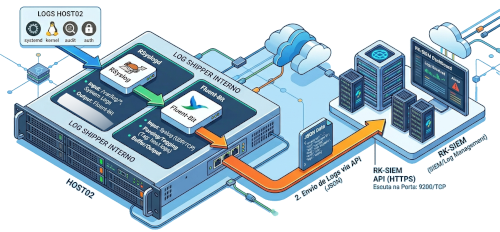
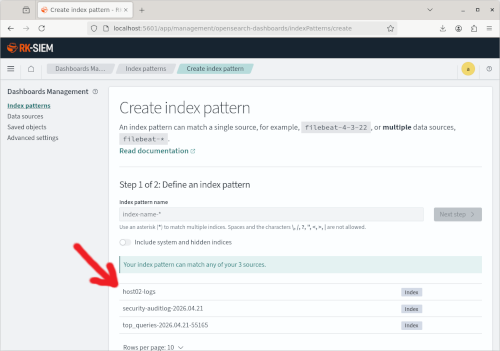
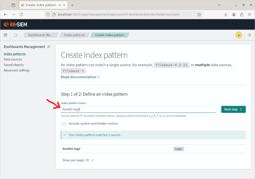
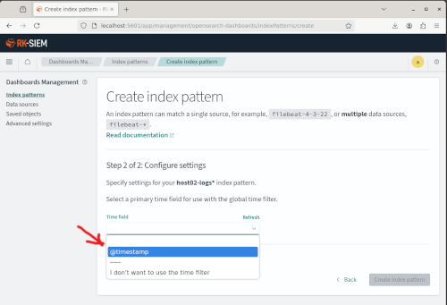
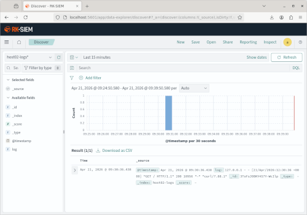

Neste segundo laboratório o objetivo é enviar Logs de um host com Linux (Debian) em seu formato nativo (Syslog) para um Logshipper (Fluent-Bit) instalado no próprio host que providenciará o envio em formato JSON para o RK-SIEM.

Para isso também utilizaremos um Docker com o Debian Linux "enxuto" (slim) adicionado dos seguintes pacotes:

<ul>
<li>RSyslog (Gerenciador de Logs do Linux)</li>
<li>Fluent-Bit</li>
<li>Apache2 -Servidor Web para gerar logs de acesso a serem enviados para o RK-SIEM</li>
</ul>

Conteúdo do docker-compose.yml referente ao Host 02:

```
services:
 rk-siem-host02:
	image: ricardokleber/rk-siem-host02:latest
	container_name: rk-siem-host02
	hostname: rk-siem-host02
	tty: true
	stdin_open: true
	restart: always
```

**Nenhum conteúdo foi adicionado ao arquivo de configuração do RSyslog!!!**

Conteúdo adicionado ao arquivo de configuração do Fluent-Bit (*/etc/fluent-bit/fluent-bit.conf*) para conexão ao RK-SIEM e envio dos Logs autenticando-se com usuário admin/admin:

```
# Capturar logs somente do apache (exemplo)

[INPUT]
    Name	tail
    Path	/var/log/apache2/access.log
    Tag		apache-logs-acesso
```

```
# Envio para o RK-SIEM-CORE

[OUTPUT]
    Name			opensearch
    Match     	    apache-logs-acesso
    Host			172.18.0.1
    Port			9200
    Index     	    host02-logs
    HTTP_User 	    admin
    HTTP_Passwd 	admin
    tls         	On
    tls.verify  	Off
```


***

**Roteiro Passo a Passo:**

**1. Baixe o Repositório GIT do projeto**

```
git clone https://gitlab.ifrncn.com.br/ricardokleber/rk-siem.git
```

**2. Entre no diretório/pasta do projeto referente ao LAB02**

(O docker-compose deste diretório já contém as configurações do HOST02)

```
cd rk-siem/roteiros/04-lab02
```

**3. Levante o RK-SIEM-CORE**

```
docker compose up -d rk-siem-core
```

**4. Levante o RK-SIEM-UI**

```
docker compose up -d rk-siem-ui
```

(Após alguns segundos você já poderá subir a interface Web RK-SIEM-UI acessando http://localhost:5061 em um navegador)


**5. Levante o RK-SIEM-HOST02**

```
docker compose up -d rk-siem-host02
```

**6. Entre no HOST02 e ative os serviços RSyslog e Apache2 e, em seguida, execute o Fluent-Bit em background**

```
docker exec -it rk-siem-host02 bash
```

```
rsyslogd
```

```
service apache2 start
```

```
/opt/fluent-bit/bin/fluent-bit -c /etc/fluent-bit/fluent-bit.conf
```

***

**7. Como filtramos no Fluent-Bit para enviar somente logs de acesso ao Servidor Web, vamos gerar pelo menos um acesso no próprio host**

```
curl http://localhost
```

**8. Acesse o RK-SIEM com as credenciais padrão**

```
Username: admin | Password: admin
```

**9. No Menu do canto superior esquerdo, na sessão 'Management' selecione 'Dashboards Management'**


**10. Selecione a opção 'Index patterns' para configurar o seu primeiro índice no RK-SIEM (para receber os Logs do HOST02)'**


**11. Clique no botão 'Create index pattern' para Criar seu primeiro índice**


Observe que o Host 02 já enviou logs para o RK-SIEM (A indicação do índice 'host02-logs' já aparece como fonte disponível)



**11. Preencha o campo 'Index pattern name' indicando que o índice que será criado deverá receber todo o tráfego de índices começando com 'host02-logs'**

```
host02-logs*
```



Clique no botão 'Next step' para o próximo passo.

**12. No campo 'Time field' você deverá indicar;selecionar o 'campo de índice de tempo' usado para indexar e exibir os logs. Clicando na seta surgirá o campo padrão utilizado em Logs '@timestamp'. Clique para selecioná-lo**

```
@timestamp
```



(Clique no botão 'Create index pattern' para finalizar a criação do índice).

**Você já poderá visualizar o log enviado do 'Host02' com o acesso ao servidor web local na seção 'Discover'**




***

**Assista à Videoaula explicativa sobre o assunto clicando na imagem abaixo:**

<a href="https://www.youtube.com/watch?v=DoedlfxmR6g" target="_blank"></a>