***

**Como enviar Logs de hosts Windows para o RK-SIEM (se o padrão Microsoft é o .EVTX)?**

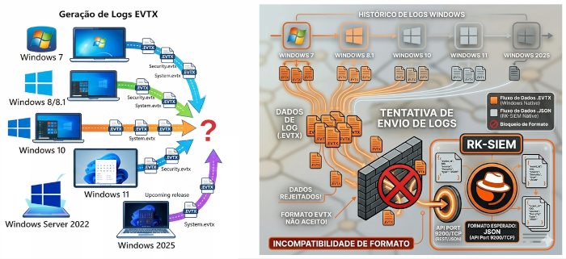

Neste terceiro laboratório o objetivo é enviar Logs de um host com Windows em seu formato nativo (.EVTX) para um Logshipper (Fluent-Bit) instalado no próprio host que providenciará o envio em formato JSON para o RK-SIEM.

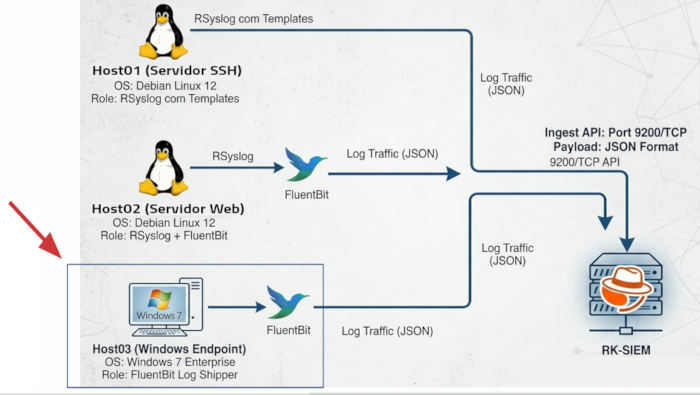

Como estamos usando o ambiente Linux para nossas práticas (e para não usar um Máquina Virtual Windows VirtualBox ou VMWare à parte em nosso cenário) faremos uso de uma "adaptação" feita pelo projeto <a href="https://github.com/dockur/windows" target="_blank">Windows Dockur</a> que executa uma máquina virtual Windows (KVM) gerenciada de dentro de um container Docker.

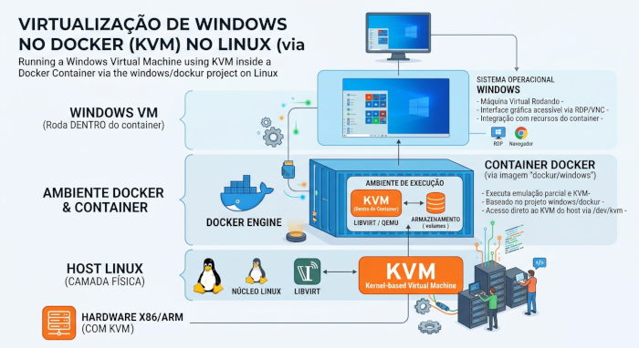

Conteúdo do docker-compose.yml referente ao Host 03:

```
services
  rk-siem-host03:
    image: docker.ifrncn.com.br/rk/rk-windows:latest
    container_name: rk-siem-host03
    devices:
      - /dev/kvm # Essencial para aceleração de hardware (KVM)
    cap_add:
      - NET_ADMIN
    ports:
      - 8006:8006 # Interface Web (NoVNC)
    volumes:
      - ./dados:/storage
    stop_grace_period: 2m
    restart: on-failure
    environment:
      VERSION: "7u" # Define a versão (win11, win10, etc)
      RAM_SIZE: "2G" # Memória RAM
      CPU_CORES: "2"   # Quantidade de núcleos
      DISK_SIZE: "15G" # Tamanho do disco virtual
      USERNAME: "admin"
      PASSWORD: "admin"
```

Em versões mais atuais do Windows (11 e/ou 2025 server) é só baixar gratuitamente a versão atualizada do <a href="https://fluentbit.io/" target="_blank">Fluent-Bit</a>, instalar e configurar seguindo as orientações deste roteiro.

Para não deixar nosso ambiente muito pesado, porém (em função dos recursos necessários para executar uma MV Windows 11/2025) fizemos a opção por instalar e configurar um Windows 7 necessitando, porém, da adição dos seguintes aplicativos:

<ul>
<li>.NET Framework 4.8</li>
<li>Fluent-Bit (versão 1.8.5)</li>
<li>NSSM (para executar o Fluent-Bit como serviço</li>
</ul>

Foram necessários, ainda, vários patches com atualizações no Windows 7 para que o sistema funcionasse perfeitamente:

<ul>
<li>KB4503575</li>
<li>KB4503575</li>
<li>KB3191566</li>
<li>KB4019990</li>
<li>KB3033929</li>
<li>KB2534111</li>
<li>KB2872035</li>
<li>KB2809215</li>
<li>KB976902</li>
</ul>

##

**ATENÇÃO!!! Se você optar por instalar "do zero" o Windows 7, deverá instalar todos os aplicativos e patches listados aqui, ou não funcionará**
##

**Para facilitar/agilizar esta prática, sugerimos baixar e utilizar a pasta compartilhada 'dados' de um Windows7 já com todos os aplicativos e patches aplicados. Disponibilizamos o passo-a-pasos em nosso Git <a href="https://gitlab.ifrncn.com.br/ricardokleber/rk-windows7" target="_blank">https://gitlab.ifrncn.com.br/ricardokleber/rk-windows7</a>**


Arquivo de configuração do Fluent-Bit (*C:\Program Files\fluent-bit\fluent-bit.conf*) para conexão ao RK-SIEM e envio dos Logs autenticando-se com usuário admin/admin:

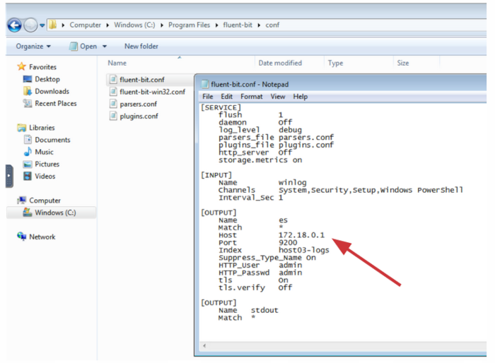

**Verifique se o IP do RK-SIEM-CORE informado é o IP do gateway da máquina Windows ou o IP do seu host real (pode ser qualquer um deles)**


***

**Roteiro Passo a Passo:**

**1. Baixe o Repositório GIT do projeto**

```
git clone https://gitlab.ifrncn.com.br/ricardokleber/rk-siem.git
```

**2. Entre no diretório/pasta do projeto referente ao LAB03**

(O docker-compose deste diretório já contém as configurações do HOST03)

```
cd rk-siem/roteiros/05-lab03
```

**3. Levante o RK-SIEM-CORE**

```
docker compose up -d rk-siem-core
```

**4. Levante o RK-SIEM-UI**

```
docker compose up -d rk-siem-ui
```

(Após alguns segundos você já poderá subir a interface Web RK-SIEM-UI acessando http://localhost:5601 em um navegador)

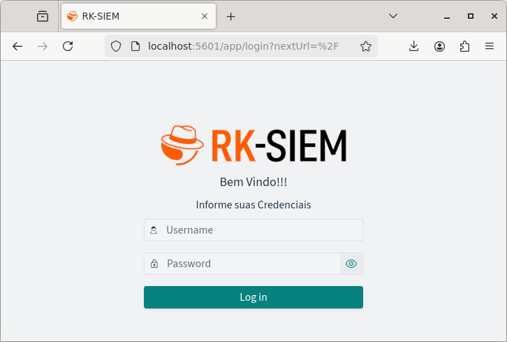

**5. Baixe e descompacte a pasta 'dados' com o Windows 7 configurado**

```
wget http://arquivos.ifrncn.com.br/windows/rk-windows7-dados.tgz
```

```
tar -xvzf rk-windows7-dados.tgz
```

**6. Levante o RK-SIEM-HOST03**

```
docker compose up -d rk-siem-host03
```

**7. Acesse o HOST03 usando um Navegador (http://localhost:8006) e verifique se o arquivo de configuração do Fluent-Bit está apontando corretamente para o IP do RK-SIEM-CORE**


**8. Acesse o RK-SIEM (http://localhost:5601) com as credenciais padrão**

```
Username: admin | Password: admin
```

**9. No Menu do canto superior esquerdo, na sessão 'Management' selecione 'Dashboards Management'**

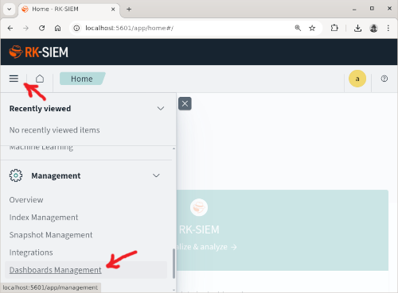

**10. Selecione a opção 'Index patterns' para configurar o seu primeiro índice no RK-SIEM (para receber os Logs do HOST03)'**

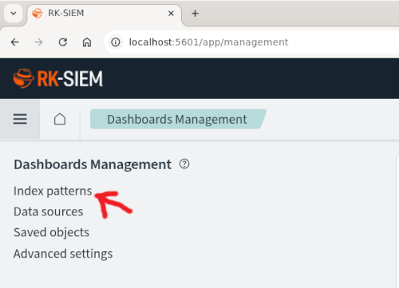

**11. Clique no botão 'Create index pattern' para Criar o índice dos logs vindos do Host03**

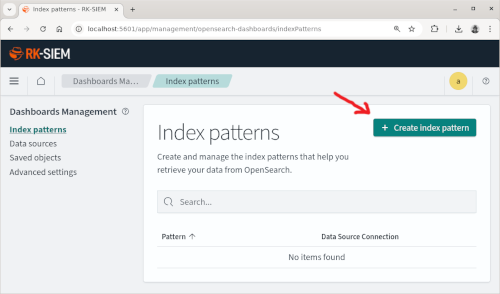

Observe que o Host 03 já enviou logs para o RK-SIEM (A indicação do índice 'host03-logs' já aparece como fonte disponível)

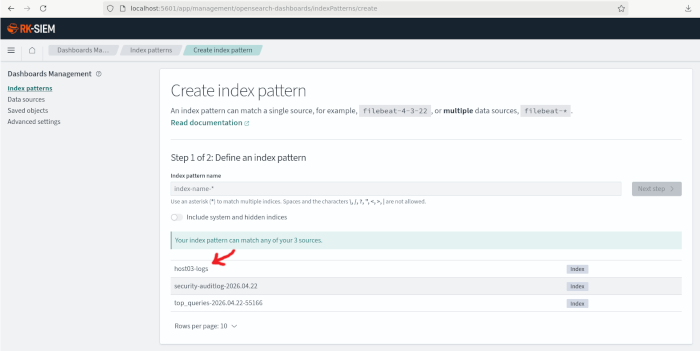

**11. Preencha o campo 'Index pattern name' indicando que o índice que será criado deverá receber todo o tráfego de índices começando com 'host03-logs'**

```
host03-logs*
```

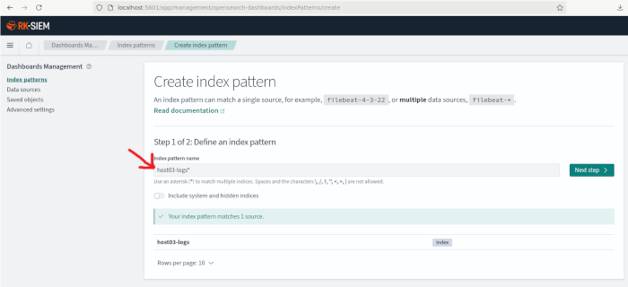

Clique no botão 'Next step' para o próximo passo.

**12. No campo 'Time field' você deverá indicar;selecionar o 'campo de índice de tempo' usado para indexar e exibir os logs. Clicando na seta surgirá o campo padrão utilizado em Logs '@timestamp'. Clique para selecioná-lo**

```
@timestamp
```
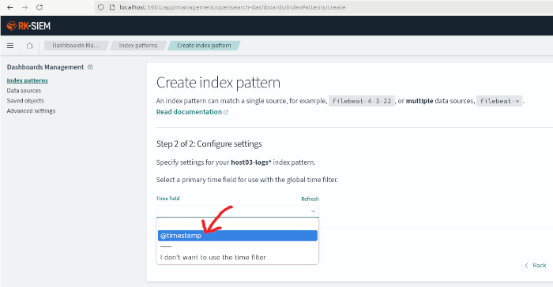


(Clique no botão 'Create index pattern' para finalizar a criação do índice).

**Você já poderá visualizar os logs enviados pelo 'Host03' na seção 'Discover'**

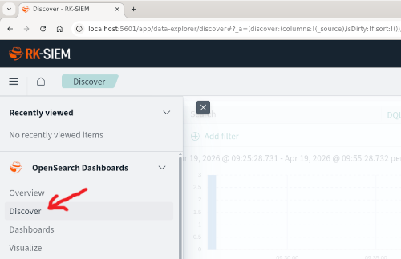

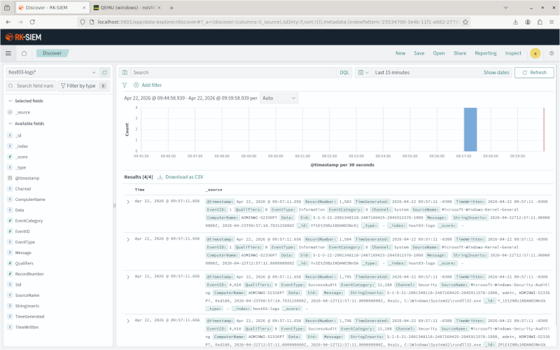

***

**Assista à Videoaula explicativa sobre o assunto clicando na imagem abaixo:**

<a href="https://www.youtube.com/watch?v=DoedlfxmR6g" target="_blank"></a>